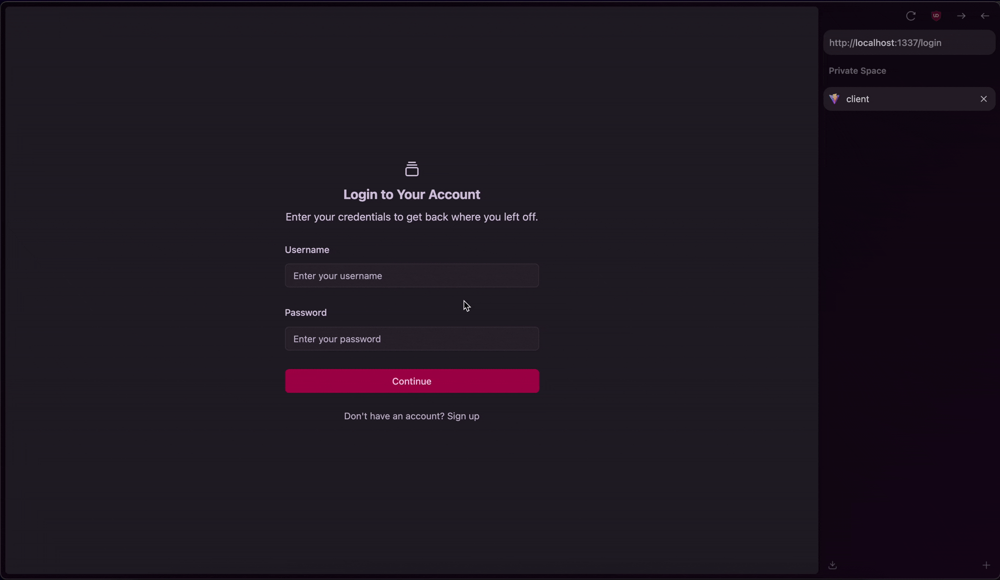

<h1 align="center">URL Shortener API</h1>

<p align="center">
  
</p>

<p align="center">
  A simple, modern, and fully customizable RESTful API that allows you to create and host your own URL shortener.
  Built with <strong>Node.js</strong>, <strong>Express</strong>, and <strong>MongoDB</strong>.
</p>

<p align="center">
  <a href="#features">Features</a> •
  <a href="#api-documentation">API Documentation</a> •
  <a href="#installation">Installation</a> •
  <a href="#usage">Usage</a> •
  <a href="#environment-variables">Environment Variables</a> •
  <a href="#contributing">Contributing</a> •
  <a href="#license">License</a>
</p>

---

## Features

* User authentication with JWT cookies
* Create short URLs for any target URL
* Free + authenticated URL creation
* Automatic visit tracking
* Custom slugs (optional)
* QR code generation
* Account-based link management
* URL management
* JSON responses for easy frontend integration
* Clean, modular Express route structure
* Ready for hosting (Railway, Render, VPS, etc.)
* Rate limiting safeguards against abuse

---

# API Documentation


## Endpoints Overview

| Group        | Description                                               |
| ------------ | --------------------------------------------------------- |
| **auth**     | signup, login, logout, deactivate account, update password |
| **urls**     | CRUD for short URLs, click tracking, QR codes             |
| **redirects** | Redirects `/:slug → original URL`                         |

---


## **Base URL**
The base URL for all API requests:

Auth requests (user logic)
```
http://localhost:8000/api/auth
```

URL requests
```
http://localhost:8000/api/urls
```

Redirect requests
```
http://localhost:8000/:slug
```


# Authentication

Authenticated routes require a **JWT cookie** set by the signup or login endpoint.

Include credentials with requests:

```
withCredentials: true
```

Or when using a tool such as Postman:

```
Settings → Cookies → Add JWT cookie
```


---

# Auth Routes

## **POST /api/auth**

Create a user account and sends a JWT cookie logging the user in.

**Access:** PUBLIC
**Rate-limit:** strict
**Sets an httpOnly JWT cookie**

### Request Body

```json
{
  "username": "john",
  "password": "password123"
}
```

### Possible Responses

#### **400 Bad Request**

```json
{
  "message": "Invalid credentials."
}
```
#### **409 Conflict Details**

```json
{ "message": "Username is already in use." }
```
#### **500 Internal Server Error**
```json
{
  "message": "We're having trouble, please try again."
}
```

#### **201 Created**
```json
{
  "_id": "691cf415e70919db7de60de0",
  "username": "john",
  "createdAt": "2025-11-18T22:32:53.402Z"
}
```

---

## **GET /api/auth/:username**

Check if a username is available.

**Access:** PUBLIC
**Rate-limit:** username check limiter

### **200 OK**

Available:

```json
{
  "message": "Username is available.",
  "taken": false
}
```

Not available:

```json
{
  "message": "Username is not available.",
  "taken": true
}
```

### **500 Internal Server Error**
```json
{
  "message": "We're having trouble, please try again."
}
```

---

## **POST /api/auth/login**

Log in a user.

**Access:** PUBLIC
**Rate-limit:** strict
**Sets an httpOnly JWT cookie**

### Request Body

```json
{
  "username": "john",
  "password": "password123"
}
```

### Possible Responses

#### **400 Bad Request**

```json
{
  "message": "Invalid credentials."
}
```

#### **401 Unauthorized**

```json
{
  "message": "Invalid username or password."
}
```

#### **404 Not Found**
```json
{
  "message": "An account with that username does not exist!"
}
```

#### **500 Internal Server Error**
```json
{
  "message": "We're having trouble logging you in, please try again."
}
```

#### **200 OK**

```json
{
  "message": "Logged in successfully, welcome back."
}
```

---

## **POST /api/auth/logout**

Logout user.
**Access:** PUBLIC
**Rate-limit:** light
**Clears JWT cookie**

### **200 OK**

```json
{
  "message": "Logged out successfully. Please come back."
}
```
#### **500 Interal Server Error**
```json
{
  "message": "We're having trouble logging you out, please try again."
}
```
---

## **POST /api/auth/deactivate**

Deactivate user account.
**Access:** PRIVATE
**Rate-limit:** light
**Destroys JWT Cookie**

### Possible Responses

#### **401 Unauthorized**
```json
{
  "message": "Invialid credentials (ID missing)."
}
```
#### **404 Not Found**
```json
{
  "message": "User not found."
}
```
#### **500 Internal Server Error**
```json
{
  "message": "We're having trouble deactivating your account, please try again soon."
}
```

#### **200 OK**

```json
{
  "message": "Account successfully deactivated. Please come back soon."
}
```

---

## **GET /api/auth/me**

Fetch user account info.
**Access:** PRIVATE
**Rate-limit:** light

### Responses

#### **401 Unauthorized**

```json
{
  "message": "Invalid credentials."
}
```

#### **404 Not Found**
```json
{
  "message": "User not found."
}
```

#### **500 Internal Server Error**
```json
{
  "message": "We're having trouble, please try again."
}
```
#### **200 OK**

```json
{
  "_id": "691cf415e70919db7de60de0",
  "username": "john",
  "createdAt": "2025-11-18T22:32:53.402Z",
  "updatedAt": "2025-11-18T22:53:53.402Z"
}
```

---

## **PUT /api/auth**

Update user password.
**Access:** PRIVATE
**Rate-limit:** strict

### Request Body

```json
{
  "currentPassword": "oldpassword123",
  "newPassword": "newpassword456"
}
```

### Error Responses

#### **400 Bad Request**

```json
{
  "message": "Missing required fields."
}
```

#### **401 Unauthorized**

```json
{
  "message": "Incorrect current password."
}
```

#### **404 Not Found**
```json
{
  "message": "User not found."
}
```
### **500 Internal Server Error**
```json
{
  "message": "We're having trouble updating your password, please try again."
}
```
### **200 OK**

```json
{
  "message": "Password updated successfully."
}
```

---

# URL Routes

## **POST /api/urls/free**

Create "free" short URL (no auth).
**Access:** PUBLIC
**Rate-limit:** light

### Request Body

```json
{
  "targetUrl": "https://google.com"
}
```
or
```json
{
  "targetUrl": "https://google.com",
  "slug": "custom-slug"
}
```
### Responses
#### **400 Bad Request**
```json
{
  "message": "You must provide a URL to shorten."
}
```
#### **409 Conflict**
```json
{
  "message": "Slug is already taken, please try again."
}
```
#### **500 Internal Server Error**
```json
{
  "message": "We're having trouble, please try again."
}
```
#### **201 Created**
```json
{
  "_id": "691d004856ec929293cf916d",
  "slug": "7ogo",
  "redirectUrl": "https://www.jsmalls.net",
  "shortUrl": "https://www.yourbackenddomain.com/7ogo",
  "createdAt": "2025-11-18T23:24:56.114Z"
}
```

---

## **POST /api/urls**

Create URL (authenticated).
**Access:** PRIVATE
**Rate-limit:** light

### Request Body
```json
{
  "slug": "custom-slug",
  "targetUrl": "https://www.jsmalls.net"
}
```
or
```json
{
  "targetUrl": "https://www.jsmalls.net"
}
```

### Responses

#### **400 Bad Request**
```json
{
  "message": "You must provide a URL to shorten."
}
```

#### **400 Bad Request**
```json
{
  "message": "Slug is already taken, please try again."
}
```

#### **401 Unauthorized**
```json
{
  "message": "Invalid credentials (ID missing)."
}
```

#### **500 Internal Server Error**
```json
{
  "message": "We're having trouble, please try again."
}
```

### **201 Created**
```json
{
	"_id": "691d004856ec929293cf916d",
	"slug": "7ogo",
	"redirectUrl": "https://www.jsmalls.net",
	"shortUrl": "https://www.yourbackenddomain.com/7ogo",
	"createdAt": "2025-11-18T23:24:56.114Z"
}

```

---

## **GET /api/urls/me**

Get all URLs for authenticated user.
**Access:** PRIVATE


### Responses

#### **401 Unauthorized**
```json
{
  "message": "Unauthorized: Missing authentication credentials."
}
```
#### **500 Internal Server Error**
```json
{
  "message": "We're having trouble retrieving your URLs, please try again soon."
}
```

#### **200 OK**

Returns an array (may be empty):

```json
[
  {
    "_id": "691d004856ec929293cf916d",
    "slug": "nasa",
    "targetUrl": "https://nasa.gov",
    "timesUsed": 10,
    "createdAt": "2025-11-18T23:24:56.114Z",
    "updatedAt": "2025-11-18T23:24:56.114Z",
  }
]
```

---

## **GET /api/urls/check-slug/:slug**

Check if slug is available.
**Access:** PUBLIC
**Rate-limit:** slug check limiter

### Responses

#### **400 Bad Request**
```json
{
  "message": "Invalid credentials."
}
```

#### **409 Conflict**
```json
{
  "message": "Slug in use, try again."
}
```
#### **500 Internal Server Error**
```json
{
  "message": "We're having trouble, please try again."
}
```


#### **200 OK**
Available:
```json
{
  "message": "Slug available!",
  "taken": false
}
```
Not available:
```json
{
  "message": "Slug in use, try again.",
  "taken": true
}
```

---

## **GET /api/urls/:id**

Fetch details of single URL.
**Access:** PRIVATE

### Responses

#### **400 Bad Request**
```json
{
  "message": "Bad Request: URL ID is missing."
}
```

#### **401 Unauthorized**
```json
{
  "message": "Unauthorized: Missing authentication credentials."
}
```

#### **403 Forbidden**
```json
{
  "message": "Forbidden: Not authorized to view this URL."
}
```

#### **404 Not Found**
```json
{
  "message": "URL not found."
}
```

### **200 OK**
```json
{
{
  "_id": "691d004856ec929293cf916d",
  "slug": "nasa",
  "targetUrl": "https://nasa.gov",
  "timesUsed": 10,
  "createdAt": "2025-11-18T23:24:56.114Z",
  "updatedAt": "2025-11-18T23:24:56.114Z",
  }
}
```

---

## **PATCH /api/urls/:id**

Update a URL.
**Access:** PRIVATE

### Request Body
```json
{
  "slug": "new-slug",
  "redirectUrl": "https://www.jsmalls.net"
}
```
Without `slug`
```json
{
  "redirectUrl": "https://www.jsmalls.net"
}
```
Without `redirectUrl`
```json
{
  "slug": "new-slug",
}
```
### Responses

#### **400 Bad Request**
```json
{
  "message": "The new slug is already taken, please try another."
}
```
#### **400 Bad Request**
```json
{
  "message": "Invalid URL ID format."
}
```

#### **401 Unauthorized**
```json
{
  "message": "Access denied. Must be authenticated to update URLs."
}

```

#### **403 Forbidden**
```json
{
  "message": "Forbidden. You can only update your own URLs."
}
```

#### **404 Not Found**
```json
{
  "message": "URL not found."
}
```

#### **500 Internal Server Error**
```json
{
  "message": "We're having trouble, please try again."
}
```

#### **200 OK**
```json
{
  "message": "URL updated successfully.",
  "url": {
    "_id": "691d004856ec929293cf916d",
    "slug": "nasa",
    "targetUrl": "https://nasa.gov",
    "timesUsed": 10,
    "createdAt": "2025-11-18T23:24:56.114Z",
    "updatedAt": "2025-11-18T23:24:56.114Z",
  }
}
```


---

## **DELETE /api/urls/:id**

Delete a URL.
**Access:** PRIVATE


### Responses

#### **400 Bad Request**
```json
{
  "message": "Access denied. Credentials or URL ID missing."
}
```

#### **403 Forbidden**
```json
{
  "message": "Forbidden. You can only delete your own URLs."
}
```

#### **404 Not Found**
```json
{
  "message": "URL not found."
}
```

#### **500 Internal Server Error**
```json
{
  "message": "We're having trouble, please try again."
}
```

#### **204 No Content**

---

## **GET /api/urls/:id/times-used**

Get `timesUsed` (click count) for a URL.
**Access:** PRIVATE

### Responses

#### **400 Bad Request**
```json
{
  "message": "Bad Request: Missing URL ID."
}
```

#### **401 Unauthorized**
```json
{
  "message": "Unauthorized: Missing credentials."
}
```

#### **403 Forbidden**
```json
{
  "message": "Forbidden: Not authorized."
}
```

#### **404 Not Found**
```json
{
  "message": "URL not found."
}
```

#### **500 Internal Server Error**
```json
{
  "message": "We're having trouble, please try again."
}
```


#### **200 OK**
```json
{
  "url": "https://www.yourbackenddomain/custom-slug",
  "timesUsed": 4029
}
```

---

## **GET /api/urls/:id/buffer**

Fetch QR code PNG buffer.
**Access:** PRIVATE
**Rate-limit:** medium
**Sends image/png**


### Responses

#### **400 Bad Request**
```json
{
  "message": "Invalid URL ID format."
}
```

#### **401 Unauthorized**
```json
{
  "message": "Unauthorized: Missing authentication credentials."
}
```

#### **403 Forbidden**
```json
{
  "message": "Forbidden: Not authorized."
}
```

#### **404 Not Found**
```json
{
  "message": "URL not found."
}
```
#### **500 Internal Server Error**
```json
{
  "message": "We're having trouble, please try again."
}
```

#### **200 OK**
QR Buffer
```json
{
    {
	    "qrCodeBuffer": {
		    "type": "Buffer",
		        "data": [
			        137,
			        80,
			        78,
			        10,
			        0,
			        0,
			        0,
			        13,
			        ...
		        ]
	        }
    }
}
```

## **GET /api/urls/user/:userId**

Check if a user has short URLs.
**Access:** PRIVATE

### Responses

#### **400 Bad Request**
```json
{
  "message": "Invalid credentials."
}
```

#### **500 Internal Server Error**
```json
{
  "message": "We're having trouble, please try again."
}
```

#### **200 OK**
No URLs
```json
{
  "message": "User has no short URLs.",
  "hasUrls": false,
  "urls": [],
}
```
Has URLs
```json
{
  "message": "User has 55 short URL's.",
  "hasUrls": true,
  "urls": [{...}],
}
```

---

## **GET /api/urls/analytics/total-clicks**

Returns total `timesUsed` across all URLs for a user.
**Access:** PRIVATE

### Responses

#### **401 Unauthorized**
```json
{
  "message": "Unauthorized: Missing authentication credentials."
}
```

#### **500 Internal Server Error**
```json
{
  "message": "We're having trouble calculating your analytics, please try again soon."
}
```

#### **200 OK**

```json
{
  "totalClicks": 999
}
```

---

## **DELETE /api/urls/all**

Delete all user URLs.
**Access:** PRIVATE
**Rate-limit:** medium

### Responses

#### **401 Unauthorized**
```json
{
  "message": "Unauthorized: Missing authentication credentials."
}
```

#### **500 Internal Server Error**
```json
{
  "message": "We're having trouble deleting your URLs, please try again soon."
}
```

#### **204 No Content**

---

# Redirect Route

## **GET /:slug**

Public redirect.

If slug exists → redirects to `redirectUrl` with HTTP status `302`.
If slug does not exist → redirects to hompage of frontend.

---

## Installation

You’ll need **Node.js (^22.13)** and **npm**/**pnpm**/**yarn** installed.

```bash
# Clone the repository
git clone https://github.com/jordansmalls/url-shortener.git

# Navigate into the directory
cd url-shortener

# Install dependencies
pnpm install
```

---

## Usage

Start the server:

```bash
pnpm start
```

Start in development mode:

```bash
pnpm run dev
```

Once running, the API will be available at:

```
http://localhost:8000
```

---

## Environment Variables

Create a `.env` file in the root directory, or simply rename the already existing `.env.example` file to `.env`


```bash
# change to 'production' when using in prod
NODE_ENV=development

# change to your Mongo DB connection URI
MONGO_URI=your_mongo_URI

# the PORT your backend will be configured to run on
PORT=8000

# your own JWT secret string, this is used to sign and verify JSON web tokens.
JWT_SECRET=yourSuperSecretJwtSecret

# The base URL of the backend (used for self referencing if needed. must match the PORT variable above)
DOMAIN=http://localhost:8000

# Link for your hosted production frontend.
# Used by CORS configuration when NODE_ENV is 'production'.
# FRONTEND_LINK=https://www.<homepage of your deployed frontend>.com

# link for your local development frontend (e.g., React/Next/Svelte/Astro dev server).
# used by CORS configuration when NODE_ENV is 'development'.
FRONTEND_LINK_DEV=http://localhost:1337
```

---

## Folder Structure

```
.
├── node_modules/              # Installed dependencies (auto-generated)
├── src/
│   ├── config/
│   │   ├── cors.js            # CORS configuration
│   │   └── db.js              # Database connection (MongoDB)
│   ├── controllers/
│   │   ├── auth.controller.js # Auth logic (login, register, JWT)
│   │   └── url.controller.js  # URL creation, management, and analytics
│   ├── middleware/
│   │   ├── auth.middleware.js # JWT auth validation
│   │   └── error.middleware.js# Centralized error handler
│   ├── models/
│   │   ├── url.model.js       # URL schema/model
│   │   └── user.model.js      # User schema/model
│   ├── routes/
│   │   ├── auth.routes.js     # Auth routes
│   │   ├── redirect.route.js  # Public redirect handler
│   │   └── url.routes.js      # URL CRUD routes
│   └── utils/
│       ├── auth.rate.limit.js # Rate limiting for auth endpoints
│       ├── generate.jwt.js    # JWT generation helper
│       ├── generate.qr.js     # QR code utility
│       ├── generate.slug.js   # URL slug generator
│       └── url.rate.limit.js  # Rate limiting for url endpoints
├── index.js                   # App entry point
├── package.json               # Project metadata & scripts
├── pnpm-lock.yaml             # Lockfile
├── README.md                  # Main documentation
```

---

## Contributing

Contributions, issues, and feature requests are welcome!

1. Fork this repository
2. Create your feature branch
3. Submit a pull request

---

## Future Improvements

- Advanced QR code generation (colors, logos, SVG exports)
- Rich click analytics (referrers, device breakdown, geo data, time-series)
- Webhook or email notifications on link visits
- Premium features for multi-tenant/public deployments
- Toggle URL active/inactive state without deleting records
- API keys for programmatic access
- Custom domain support per user
- Ability to pause/disable URLs without deleting them
- Premium-tier features (paid custom slugs, vanity domains, rate limit boosts)

---


## License


This project is licensed under the **[MIT License](./LICENSE)**.

---
